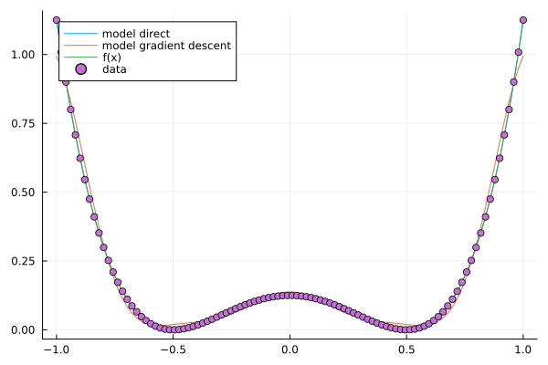
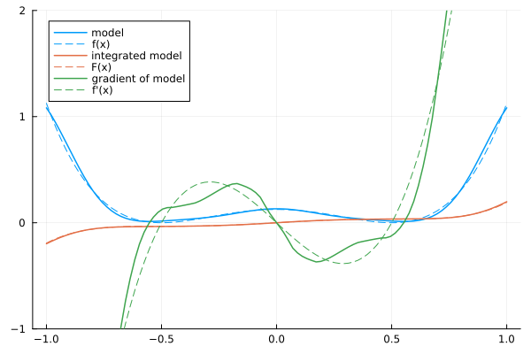
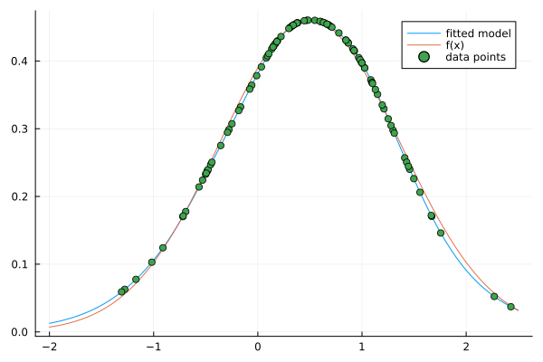

# PSDModels
Simple implementation of models of the type
$$f(x) = \sum_{ij} k(x,x_i) B_{ij} k(x,x_j)$$
where $k$ is a Kernel function. This is based on a paper by Marteau-Ferey et al. (see [1]).

This library should in the future implement recent methods for PSD models found in the literature. Currently, it supports:
- Creation and evaluation of PSD models for any dimensions and data types equipped with a distance.
- Multiplication with a scalar, gradient, gradient with respect to the matrix B, integration over a domain.
- fitting points and minimization of a function $$L$$ to minimize
$$\arg,\min_{B \geq 0} \mathcal L (f(x_1; B), f(x_2; B), ..., f(x_n; B)) + \lambda_1 tr(B)$$.

Applications are everywhere, where positive functions are needed, e.g. density estimation (constraint to $$\int_\Omega f(x) \mathrm{d}x = 1$$ not supported yet, instead posteriori normalization).

For examples see in folder examples and below.

## Table of Contents of Examples
1. [Creation of a 1D model](#Creation-of-a-model)
2. [Creation of a 2D model](#creation-of-a-2d-model)
3. [Differentiation and integration](#differentiation-and-integration)
4. [Density estimation](#density-estimation)


### Creation of a model
```julia
using PSDModels
using KernelFunctions # get your kernels from here
using LinearAlgebra

# positive function to be approximated from samples
f(x) = 2*(x-0.5)^2 * (x+0.5)^2

# Generate some data
N = 100
X = collect(range(-1, 1, length=N))
Y = f.(X)

# Create a model
k = MaternKernel(ν=1.5) # kernel to be used

# direct solution, using a regularization "λ_1" if the condition number
# of the kernel matrix is higher than "cond_thresh"
model_direct = PSDModel(X, Y, k, solver=:direct)

# solution by proximal gradient descent using a regularization "λ_1"
# solving the problem:
# B = argmin_B MSE(f(x; B), y) + λ_1 tr(B)
model_gd = PSDModel(X, Y, k, solver=:gradient_descent)

# Create an empty model with fixed support points to use it later on
model_empty = PSDModel(k, X)
# the model can now be fitted to some data or used to minimize a function
fit!(model_empty, X, Y)

# evaluate the model
model_gd(0.2)

# modify the model
model_gd = 2*model_gd
```
For the right sampling points of a Kernel and low condition numbers,
the direct solver can be used, in all other cases it is better to use
the gradient descent solver.
Equidistant using the Matern Kernel:


Uniform random sampling points with a regularization of the direct solver:


### Creation of a 2D model
See examples, "2D_fit_model.jl".

### Differentiation and Integration
```julia
using DomainSets # use this to define integration domains.
# at the moment only interval domains of type [a, b] are supported.

# get the gradient at the point 0.5
gradient(model, 0.5)

# integrate over a simple domain
integral(model, -2..2)
```
Example figure:



### Density estimation
```julia
# draw samples from a pdf
X = randn(100) * 0.75 .+ 0.5
pdf_X(x) = 1/(2*pi*0.75)^0.5 * exp(-(x-0.5)/(2*0.75))

# define log-likelihood loss function
loss(Z) = 1/length(Z) * sum(log.(Z))

# minimize the loss functions evaluated at the points X,
# so that loss(f(x_1),f(x_2),...,f(x_N)) gets minimized
# where f is the model and x_i in X.
minimize!(model, loss, X)
```
Example figure:



### References
[1] U. Marteau-Ferey, F. Bach, and A. Rudi, “Non-parametric Models for Non-negative Functions” url: https://arxiv.org/abs/2007.03926
