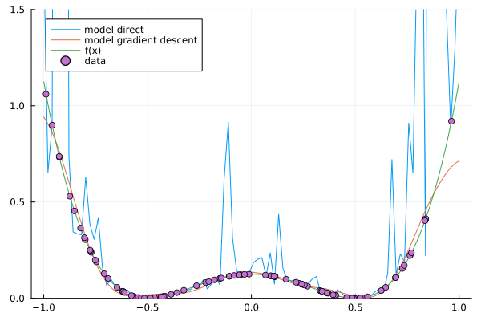

# PSDModels
Simple implementation of models of the type
$$f(x) = \sum_{ij} k(x,x_i) B_{ij} k(x,x_j)$$
where $k$ is a Kernel function. This is based on a paper by Marteau-Ferey et al. (see [1]).

Currently, the usage of this library is the following:

```julia
using PSDModels
using KernelFunctions # get your kernels from here
using LinearAlgebra

# positive function to be approximated from samples
f(x) = 2*(x-0.5)^2 * (x+0.5)^2

# Generate some data
N = 100
X = collect(range(-1, 1, length=N))
Y = f.(X)

# Create a model
k = MaternKernel(ν=1.5) # kernel to be used

# direct solution, using a regularization "λ_1" if the condition number
# of the kernel matrix is higher than "cond_thresh"
model = PSDModel(X, Y, k, solver=:direct)

# solution by proximal gradient descent using a regularization "λ_1"
# solving the problem:
# B = argmin_B MSE(f(x; B), y) + λ_1 tr(B)
model = PSDModel(X, Y, k, solver=:gradient_descent)

# evaluate the model
model(0.2)

# modify the model
model = 2*model
```

For the right sampling points of a Kernel and low condition numbers,
the direct solver can be used, in all other cases it is better to use
the gradient descent solver.
Equidistant using the Matern Kernel:


Uniform random sampling points with a regularization of the direct solver:


### References
[1] U. Marteau-Ferey, F. Bach, and A. Rudi, “Non-parametric Models for Non-negative Functions” url: https://arxiv.org/abs/2007.03926
